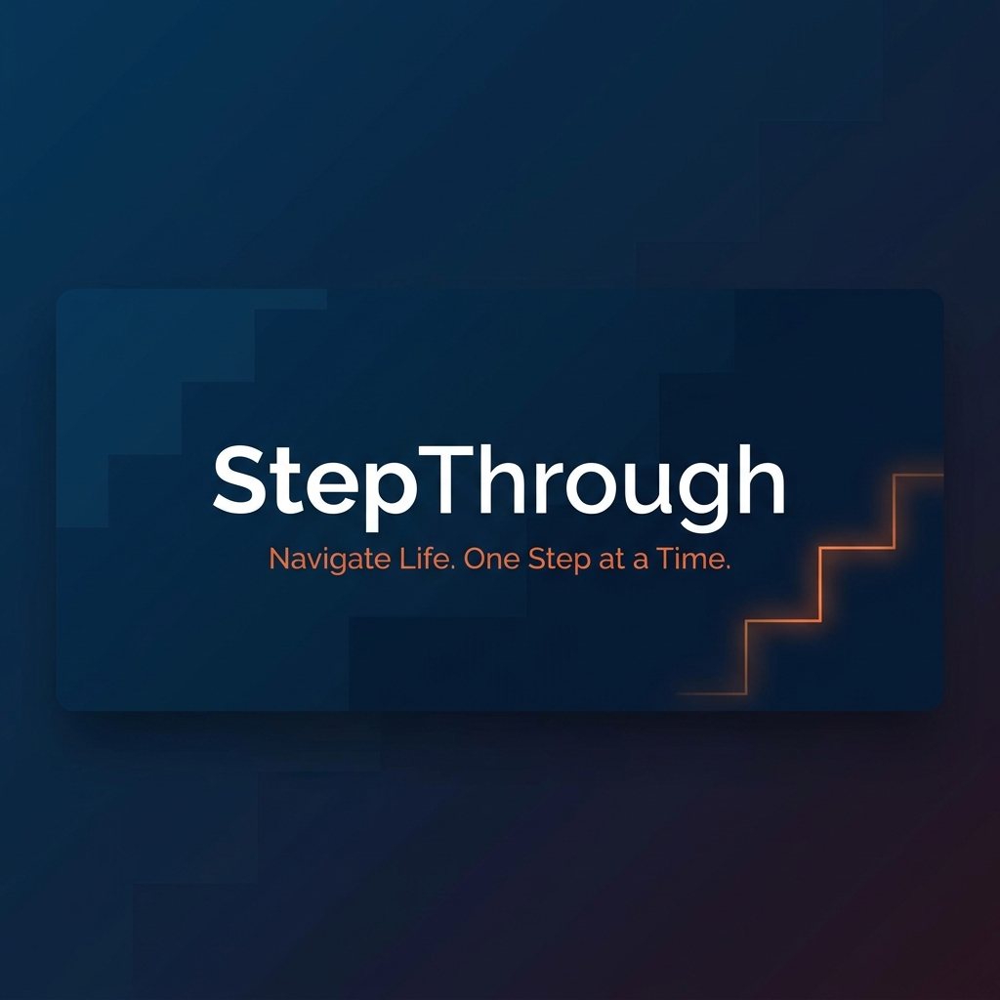

<p align="center">
  
</p>

<h1 align="center">🏛️ StepThrough</h1>

<p align="center">
  <strong>Navigate Life. One Step at a Time.</strong>
</p>

<p align="center">
  An AI-powered life-navigation platform that helps Indian citizens discover, understand, and complete government services — from passports to scholarships — with guided step-by-step journeys.
</p>

<p align="center">
  <a href="https://nishtha-step-through.vercel.app/"></a>&nbsp;
  <a href="https://huggingface.co/spaces/nishtha-agarwal-211/StepThrough"></a>&nbsp;
  <a href="https://github.com/nishtha-agarwal-211/StepThrough"></a>
</p>

<p align="center">
  
  
  
  
  
  
</p>

---

## 🎯 The Problem

> _"Indian citizens miss **₹2.7 lakh crore** in unclaimed government benefits every year — not because they're ineligible, but because the process is too complex to navigate."_

Applying for government services in India is fragmented, confusing, and intimidating. Citizens face:

- **Information overload** — 700+ central & state schemes, each with unique portals
- **Procedural complexity** — multi-step processes spanning weeks with no clear guidance
- **Document anxiety** — unclear requirements leading to repeated rejections
- **Zero tracking** — no unified view of where you stand across multiple applications

**StepThrough solves this** by transforming every government process into a clear, trackable, guided journey.

---

## ✨ Key Features

### 🧭 Guided Step-by-Step Journeys

Every service — from applying for a passport to filing ITR — is broken down into **bite-sized, actionable steps** with estimated timelines, required documents, and pro tips at each stage.

### 🤖 AI Mentor (Powered by Meta Llama 3)

An intelligent assistant trained on Indian government procedures that can:

- Answer questions about any scheme or process in plain language
- Generate personalized action plans based on your profile
- Provide real-time guidance with document checklists

### 🏛️ Government Schemes Explorer

A comprehensive, searchable catalog of **60+ government schemes** across 12 categories:

| Category              | Examples                                            |
| :-------------------- | :-------------------------------------------------- |
| 🪪 Identity & KYC     | Aadhaar, PAN Card, Voter ID, Driving License        |
| ✈️ Passport & Visa    | Fresh Passport, Renewal, Tatkal, PCC                |
| 💰 Finance & Tax      | ITR Filing, PM Jan Dhan, MUDRA Loans, GST           |
| 🎓 Education          | National Scholarships, PM Vidyalakshmi, Skill India |
| 🤝 Welfare            | PM Awas Yojana, Ayushman Bharat, e-Shram            |
| 🏥 Healthcare         | ABHA Health ID, Jan Aushadhi, PMJAY                 |
| 🌾 Agriculture        | PM-KISAN, Fasal Bima, KCC                           |
| 🚀 Business & Startup | Startup India, Stand-Up India, Udyam                |

### 📄 Smart Document Center

Track, upload, and manage all your essential documents in one place with:

- Status tracking (Missing → Uploaded → Verified)
- Expiry alerts and renewal reminders
- Cross-referencing with active journey requirements

### 📊 Personalized Dashboard

- Real-time progress tracking across all active journeys
- Smart action prioritization based on deadlines and urgency
- Achievement system to gamify the process
- Awareness score that grows as you discover more schemes

### 🔐 Authentication

- Email/password registration and login
- Google OAuth integration
- Persistent session management via Zustand

### 🌙 Dark Mode

Full dark/light theme support with smooth transitions, designed for extended reading sessions.

---

## 🏗️ Architecture

```
┌──────────────────────────────────────────────────────────┐
│                      FRONTEND                            │
│               Next.js 16 + React 19 + TypeScript         │
│                                                          │
│  ┌──────────┐ ┌──────────┐ ┌──────────┐ ┌──────────┐     │
│  │Dashboard │ │ Journey  │ │ Schemes  │ │ AI Chat  │     │
│  │  View    │ │  View    │ │ Explorer │ │  Guide   │     │
│  └──────────┘ └──────────┘ └──────────┘ └──────────┘     │
│  ┌──────────┐ ┌──────────┐ ┌──────────┐                  │
│  │ Document │ │Onboarding│ │   Auth   │                  │
│  │  Center  │ │   Flow   │ │   Page   │                  │
│  └──────────┘ └──────────┘ └──────────┘                  │
│                                                          │
│  State: Zustand (persisted) │ Animations: Framer Motion  │
│  Charts: Recharts           │ Icons: Lucide React        │
│  Styling: TailwindCSS 4     │ Themes: next-themes        │
│                                                          │
│                  Deployed on: Vercel                     │
├──────────────────────────────────────────────────────────┤
│                      BACKEND                             │
│               Python FastAPI + Gradio                    │
│                                                          │
│  ┌──────────────────────────────────────────────────┐    │
│  │  /api/schemes       → Scheme catalog + search    │    │
│  │  /api/schemes/:slug → Step-by-step details (AI)  │    │
│  │  /api/chat          → AI Mentor conversation     │    │
│  │  /api/auth/*        → User authentication        │    │
│  └──────────────────────────────────────────────────┘    │
│                                                          │
│  AI: HuggingFace Inference API (Meta-Llama-3-8B-Instruct)│
│  Fallback: Pre-compiled rule-based guides                │
│                                                          │
│               Deployed on: Hugging Face Spaces           │
└──────────────────────────────────────────────────────────┘
```

---

## 🚀 Quick Start

### Prerequisites

| Tool    | Version             |
| :------ | :------------------ |
| Node.js | ≥ 18.x              |
| npm     | ≥ 9.x               |
| Python  | ≥ 3.9 (for backend) |

### 1️⃣ Clone the repository

```bash
git clone https://github.com/nishtha-agarwal-211/StepThrough.git
cd StepThrough
```

### 2️⃣ Install frontend dependencies

```bash
npm install
```

### 3️⃣ Run the development server

```bash
npm run dev
```

Open [http://localhost:3000](http://localhost:3000) to see StepThrough in action.

### 4️⃣ Backend setup (optional — for AI features)

```bash
cd backend
python -m venv venv
source venv/bin/activate   # On Windows: venv\Scripts\activate
pip install -r requirements.txt
```

Set your Hugging Face token:

```bash
export HF_TOKEN=your_huggingface_token
```

Start the backend:

```bash
uvicorn app:app --reload --port 7860
```

---

## 📁 Project Structure

```
StepThrough/
├── src/
│   ├── app/
│   │   ├── api/              # Next.js API routes (auth, schemes, user)
│   │   ├── auth/             # Authentication page
│   │   ├── globals.css       # Design system & theme tokens
│   │   ├── layout.tsx        # Root layout with fonts & theme
│   │   ├── page.tsx          # Main app entry with routing
│   │   └── icon.png          # App favicon
│   ├── components/
│   │   ├── assistant/        # AI chat guide & assistant panel
│   │   ├── dashboard/        # Stats grid, cards, action items
│   │   ├── documents/        # Document management center
│   │   ├── journey/          # Step-by-step journey tracker
│   │   ├── layout/           # App shell & navigation
│   │   ├── onboarding/       # Multi-step onboarding wizard
│   │   ├── schemes/          # Government schemes explorer
│   │   ├── theme-provider.tsx
│   │   └── theme-toggle.tsx
│   └── lib/
│       ├── data.ts           # Seed data for opportunities & journeys
│       ├── schemes-data.ts   # 60+ government schemes catalog
│       ├── store.ts          # Zustand state management
│       ├── types.ts          # TypeScript type definitions
│       └── utils.ts          # Utility functions
├── backend/
│   ├── app.py                # FastAPI + Gradio backend
│   ├── schemes_data.py       # Python schemes data mirror
│   ├── requirements.txt      # Python dependencies
│   └── Dockerfile            # HuggingFace Spaces container
├── public/
│   └── assets/               # Images & static assets
├── next.config.ts
├── vercel.json               # Vercel deployment config
├── package.json
└── tsconfig.json
```

---

## 🎨 Design System

StepThrough uses a carefully crafted design language inspired by **Indian government trust aesthetics** combined with **modern SaaS premium UX**:

| Token                 | Light Mode | Dark Mode | Purpose                |
| :-------------------- | :--------- | :-------- | :--------------------- |
| `--st-accent-gold`    | `#E06A3B`  | `#E06A3B` | Primary saffron accent |
| `--st-accent-mocha`   | `#0A3054`  | `#93C5FD` | Official navy blue     |
| `--st-accent-success` | `#15803D`  | `#4ADE80` | Eligibility & progress |
| `--st-bg-base`        | `#FAFAF9`  | `#0B1120` | Page background        |
| `--st-text-primary`   | `#0F172A`  | `#F1F5F9` | Primary text           |

**Typography**: Inter (body) + Space Grotesk (headings) via `next/font`

---

## 🌐 Deployment

### Frontend — Vercel

The frontend is deployed on [Vercel](https://vercel.com) with automatic Git-based deployments.

**Live URL**: [nishtha-step-through.vercel.app](https://nishtha-step-through.vercel.app/)

### Backend — Hugging Face Spaces

The Python backend runs as a Gradio + FastAPI app on Hugging Face Spaces with Docker.

**Live URL**: [huggingface.co/spaces/nishtha-agarwal-211/StepThrough](https://huggingface.co/spaces/nishtha-agarwal-211/StepThrough)

---

## 🛠️ Tech Stack

| Layer             | Technology               | Purpose                                 |
| :---------------- | :----------------------- | :-------------------------------------- |
| **Framework**     | Next.js 16               | App router, SSR, API routes             |
| **UI Library**    | React 19                 | Component-based UI                      |
| **Language**      | TypeScript 5             | Type safety                             |
| **Styling**       | TailwindCSS 4            | Utility-first CSS                       |
| **State**         | Zustand                  | Lightweight state management            |
| **Animations**    | Framer Motion            | Smooth transitions & micro-interactions |
| **Charts**        | Recharts                 | Data visualization                      |
| **Icons**         | Lucide React             | Consistent icon system                  |
| **Theming**       | next-themes              | Dark/Light mode                         |
| **Backend**       | FastAPI + Gradio         | Python API server                       |
| **AI Model**      | Meta Llama 3 8B Instruct | Conversational AI mentor                |
| **AI API**        | HuggingFace Inference    | Model hosting & inference               |
| **Frontend Host** | Vercel                   | Edge deployment                         |
| **Backend Host**  | HuggingFace Spaces       | GPU-backed hosting                      |

---

## 🤝 Contributing

Contributions are welcome! Here's how to get started:

1. **Fork** the repository
2. **Create** a feature branch (`git checkout -b feature/amazing-feature`)
3. **Commit** your changes (`git commit -m 'feat: add amazing feature'`)
4. **Push** to the branch (`git push origin feature/amazing-feature`)
5. **Open** a Pull Request

---

## 👩‍💻 Authors

<table>
  <tr>
    <td align="center">
      <a href="https://github.com/nishtha-agarwal-211">
        <br />
        <sub><b>Nishtha Agarwal</b></sub>
      </a>
    </td>
    <td align="center">
      <a href="https://github.com/anant2526">
        <br />
        <sub><b>Anant Sharma</b></sub>
      </a>
    </td>
    <td align="center">
      <a href="https://github.com/sharmavikas18">
        <br />
        <sub><b>Vikas Sharma</b></sub>
      </a>
    </td>
  </tr>
</table>

---

## 📄 License

This project is open-sourced under the [MIT License](LICENSE).

---

<p align="center">
  
</p>

<p align="center">
  <strong>StepThrough</strong> — Making government services accessible, one step at a time.<br/>
  <sub>Built with ❤️ for every Indian citizen.</sub>
</p>
